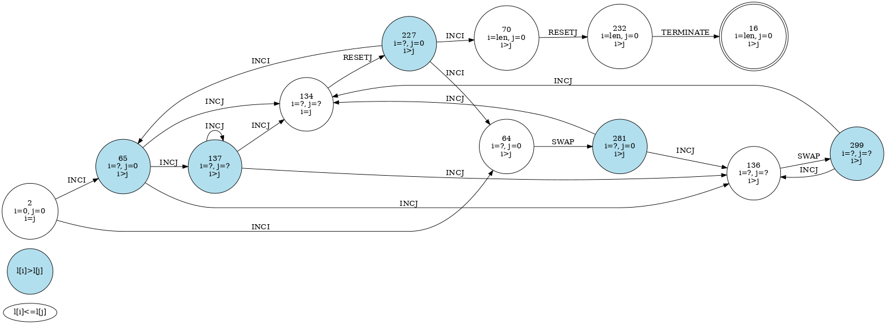

# RLSort
Sorting with Q-learning and reconstruction of the learned algorithm in a human-readable interpretation

## Resulting algorithm after *~5M* episodes: [transitions.csv](transitions.csv)



### Transition table (simplified)
Initial values: *j = 0* and *i = 1*

| l[i] vs l[j] | i vs j | i | j | last action | to-be-executed action |
|:------------:|:------:|:-:|:-:|:-----------:|:---------------------:|
|      ?       |   ?    | 1 | ? |      ?      |       TERMINATE       |
|      ?       |   0    | 0 | ? |      ?`     |     RESETJ + INCI     |
|      0       |   1    | 0 | ? |      ?      |      SWAP + INCJ      |
|      1       |   ?    | ? | ? |      ?      |          INCJ         |

### Pseudo Code
```python
if i == len(l):
    action <- TERMINATE
elif l[i] > l[j]:
    action <- INCJ
elif i > j:
    action <- SWAP
    action <- INCJ
else:
    action <- RESETJ
    action <- INCI
```

### Performance comparison: [RLSort.ipynb](RLSort.ipynb)


### Example call
```
  2 <<- [6 4 3 7 0], i=0, j=0: INCI.
 64 <<- [6 4 3 7 0], i=1, j=0: SWAP.
281 <<- [4 6 3 7 0], i=1, j=0: INCJ.
134 <<- [4 6 3 7 0], i=1, j=1: RESETJ.
227 <<- [4 6 3 7 0], i=1, j=0: INCI.
 64 <<- [4 6 3 7 0], i=2, j=0: SWAP.
281 <<- [3 6 4 7 0], i=2, j=0: INCJ.
136 <<- [3 6 4 7 0], i=2, j=1: SWAP.
299 <<- [3 4 6 7 0], i=2, j=1: INCJ.
134 <<- [3 4 6 7 0], i=2, j=2: RESETJ.
227 <<- [3 4 6 7 0], i=2, j=0: INCI.
 65 <<- [3 4 6 7 0], i=3, j=0: INCJ.
137 <<- [3 4 6 7 0], i=3, j=1: INCJ.
137 <<- [3 4 6 7 0], i=3, j=2: INCJ.
134 <<- [3 4 6 7 0], i=3, j=3: RESETJ.
227 <<- [3 4 6 7 0], i=3, j=0: INCI.
 64 <<- [3 4 6 7 0], i=4, j=0: SWAP.
281 <<- [0 4 6 7 3], i=4, j=0: INCJ.
136 <<- [0 4 6 7 3], i=4, j=1: SWAP.
299 <<- [0 3 6 7 4], i=4, j=1: INCJ.
136 <<- [0 3 6 7 4], i=4, j=2: SWAP.
299 <<- [0 3 4 7 6], i=4, j=2: INCJ.
136 <<- [0 3 4 7 6], i=4, j=3: SWAP.
299 <<- [0 3 4 6 7], i=4, j=3: INCJ.
134 <<- [0 3 4 6 7], i=4, j=4: RESETJ.
227 <<- [0 3 4 6 7], i=4, j=0: INCI.
 70 <<- [0 3 4 6 7], i=5, j=0: RESETJ.
232 <<- [0 3 4 6 7], i=5, j=0: TERMINATE.
Sorted list in 28 steps: [0 3 4 6 7]
```

